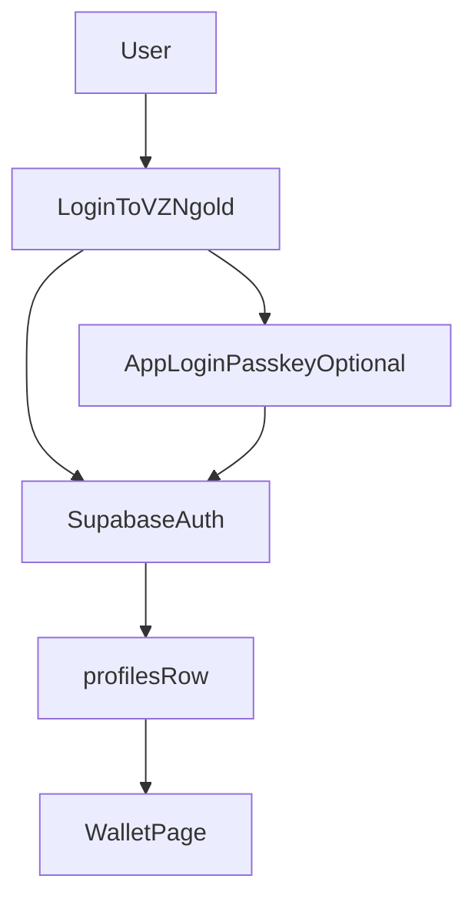
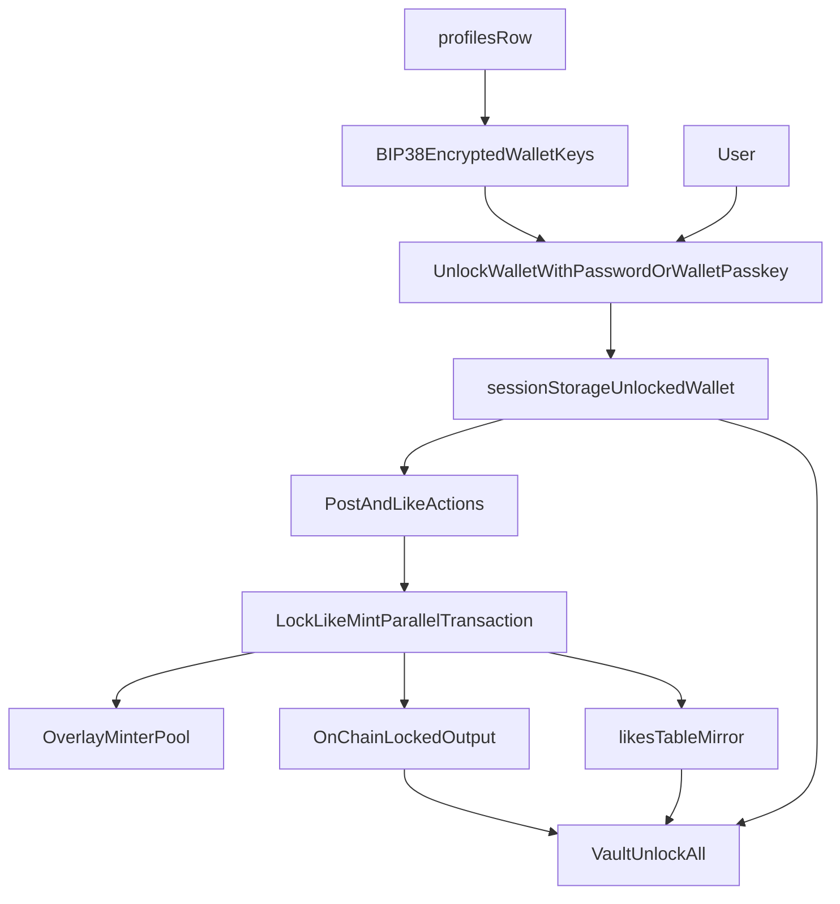

# VZN.gold

`VZN.gold` is a social platform built around one core primitive: the `LockLikeMintBSV21Parallel` smart contract (see `src/contracts/LockLikeMintBSV21Parallel.ts`), aka `LLM-21`.

What makes `LLM-21` stand out is that a like is not just social metadata. In this system, a user [locks satoshis](https://github.com/shruggr/lockup/blob/main/src/contracts/lockup.ts), includes [a like](https://bitcoinschema.org/docs/schemas/social-actions#like) in the transaction, and receives a [token mint](https://docs.1satordinals.com/fungible-tokens/bsv-21) if the contract rules are satisfied. That means this repo is really about a lock-like-mint social primitive enforced by the contract itself, with the wallet flow, transaction assembly, and app infrastructure built around it.

Because the repo is open source, anyone can inspect how the contract is used, how transactions are assembled, and how the surrounding auth/data plumbing works.

The contract is a [BSV-21](https://docs.1satordinals.com/fungible-tokens/bsv-21) token minter with lock-like-mint rules:

- a user locks satoshis for a fixed number of blocks
- the transaction includes a MAP "like" output referencing a post
- if the lock qualifies, the contract mints a fixed token reward
- the mint is capped by the remaining on-chain supply

## Feed: `NEW` And `TOP`

The main feed in `app/components/Feed.tsx` has two modes that represent two different ways of looking at the network.

### `NEW`

`NEW` is the chronological feed.

It is optimized around fresh activity:

- it shows the latest posts first
- it listens for realtime post, like, and reply updates
- it can show a "new posts" indicator when activity arrives while the user is on another tab
- clicking `NEW` again can refresh the feed and jump back to the top

So `NEW` answers the question: what is happening right now?

### `TOP`

`TOP` is the ranked feed.

It is optimized around economic commitment rather than just recency:

- posts are fetched through the ranked feed path instead of the pure chronological one
- the ranking depends on lock activity, so likes with locked sats affect what rises
- it supports time windows like day, week, month, year, and all time
- when new likes arrive, the ranked feed is invalidated and recomputed instead of being patched in place client-side

So `TOP` answers the question: what content is attracting the strongest lock-backed conviction?

## Trade Page

The `/trade` page is the in-app market view for the current `LLM-21` token lineage, which on `VZN.gold` means `$VZN`.

It currently does a few things:

- shows a `$VZN` price chart built from recent sales history
- shows the user's available `$VZN` balance when a wallet is unlocked
- shows marketplace listings for the token tied to `NEXT_PUBLIC_LLM21_ORIGIN_ID`
- lets users list tokens, buy listed tokens, and cancel their own listings
- separates marketplace data into `Listed`, `Sales`, and `My Orders`

So `/trade` is where the repo's token side becomes visible as a market, not just as a reward emitted by lock-like-mint transactions.

## Leaderboard Page

The `/leaderboard` page is the social/economic ranking view for lockers on the platform.

It currently:

- fetches profiles with active, unspent locks
- ranks users by total active locked sats
- shows active lock count per profile
- shows total value locked at the top of the page
- converts locked sats into a USD view using the current BSV exchange rate

So `/leaderboard` turns the lock side of the system into a visible scoreboard of commitment, not just a hidden backend metric.

## Contract Overview

`LockLikeMintBSV21Parallel` is the parallel variant of the original lock-like-mint contract. It keeps the same economic rules, but changes how remaining supply is carried forward so multiple mints can proceed at once instead of queuing on a single contract UTXO.

The contract tracks and enforces:

- remaining token `supply` for the branch being spent
- minimum satoshis required to qualify for a mint (`sats`)
- required lock duration in blocks (`blocks`)
- reward limit per qualifying mint (`lim`)
- `splitThreshold`: when remaining supply after a mint is at or above this value, the contract splits into two successor minter branches
- a required service fee output (`feeOutput`)
- a **starting block height** (`startHeight` in the constructor), which sets the initial `lastHeight` and enforces that `nLockTime` never decreases across mints

At a high level, the contract still means:

- it is a BSV-21 token minter
- a user must lock at least `sats` satoshis for `blocks` blocks
- the transaction must include a MAP like output
- outputs are enforced on-chain as successor state, lockup, like, reward, fee, and change

## How Parallel Minting Works

The original `LockLikeMintBSV21` design kept one live minter UTXO at a time. Every mint had to spend that exact UTXO, update it, and create one successor state output. Under load, that creates contention: two users trying to like at the same time are racing for the same outpoint.

`LockLikeMintBSV21Parallel` turns the mint lineage into a binary tree:

- each mint spends one live minter/token UTXO from a branch
- after minting the reward, the contract creates up to **two** successor minter UTXOs containing the remaining supply
- if `remainingSupply >= splitThreshold`, supply is split with `firstBranchSupply = ceil(remainingSupply / 2)` and the rest going to the second branch
- if remaining supply is below `splitThreshold`, only one successor branch is created

That means many unspent minter branches can exist at once, all tied to the same token origin ID. Different users can mint from different branches concurrently, similar in spirit to parallel minting patterns used elsewhere in BSV token systems.

Important properties that do **not** change:

- total minted supply is still capped by the token's original `max`
- each branch only mints from its own `supply` field
- lock, like, reward, and fee rules are the same as the non-parallel contract

## How The Mint Works

At mint time, the contract verifies:

- `nLockTime` is not going backwards (enforced against the branch's `lastHeight`)
- `sequence < 0xffffffff`
- the lock amount meets the minimum threshold
- the output hash matches the exact required structure

The mint logic is:

- the transaction must use a valid `nLockTime` and `sequence`
- the user must lock at least the required sat amount
- the lock output is built so those sats stay locked until `nLockTime + blocks`
- the transaction must include the MAP like output tied to the target post
- if those conditions are satisfied, the contract mints up to `lim` tokens from the spent branch, capped by that branch's remaining `supply`
- if supply remains, the contract creates one or two successor minter outputs for the next mints

That means the contract itself, not just the frontend, defines whether a lock-like qualifies for a mint and how the remaining supply is split forward.

## Transaction Structure

The mint transaction is intentionally structured and the contract checks the output order.

For a successful parallel mint, outputs are built in this order:

1. First successor state/minter output, if supply remains on branch A
2. Second successor state/minter output, if supply remains on branch B
3. Lockup output containing the user's block-locked satoshis
4. Zero-sat `OP_FALSE OP_RETURN` MAP like output
5. Reward token transfer output to the user
6. Required fee/service output
7. Change output

That ordering is mirrored both:

- on-chain in `LockLikeMintBSV21Parallel.mint(...)`
- off-chain in `LockLikeMintBSV21Parallel.buildTxForMint(...)`

On parallel mint transactions, the lock output index depends on how many successor branches the mint creates. When both branches are created, the lock is at vout `2`; when only one successor branch remains, the lock moves to vout `1`.

The MAP like output carries:

- the app name
- the `type=like` metadata
- the target post transaction ID

That output shape is intentional. The "like" is not just app-specific metadata, it follows the Bitcoin Schema social-action convention for a like, where the payload identifies the app, declares `type=like`, and points at the liked transaction.

In other words, the lock/mint transaction is also publishing a recognizable social action, not just a private app marker. That is why the like output is a zero-sat `OP_FALSE OP_RETURN` MAP record in that exact position and format.

Reference: [Bitcoin Schema Social Actions](https://bitcoinschema.org/docs/schemas/social-actions).

So the transaction itself encodes both economic behavior and social context.

## Where The App Uses The Contract

The main contract interaction path is in `app/components/Post/lockActions.ts`.

That flow does the following:

- loads the `LockLikeMintBSV21Parallel` artifact
- reads `NEXT_PUBLIC_LLM21_ORIGIN_ID`
- asks `/api/overlay/minters` for a live minter UTXO from the token's minter pool
- reserves that outpoint in browser `sessionStorage` so concurrent mint attempts do not pick the same branch
- reconstructs the selected branch with `LockLikeMintBSV21Parallel.fromUTXO(...)`
- derives the lock destination from the user's payment key
- derives the reward destination from the user's owner key
- calls `buildTxForMint(...)`
- creates the unlocking script for `mint(...)`
- includes the required app/service fee output enforced by the contract, because dev gotta eat
- adds a wallet funding input and change output to pay for the transaction and fee
- fetches BEEF for the built transaction
- broadcasts through ARC and submits to the BSV21 overlay
- stores the resulting like row in Supabase

The minter picker lives in `app/api/overlay/minters/route.ts`. It queries the overlay for unspent BSV-21 outputs on vout `0` or `1` with ops like `transfer`, `deploy+mint`, or `mint`, filters to the configured origin ID, excludes outpoints already reserved by the client, and prefers branches with the most remaining supply.

So Supabase is not the source of truth for the like itself. The chain transaction comes first, and the database records app state around it after broadcast succeeds.

## What `NEXT_PUBLIC_LLM21_ORIGIN_ID` Points To

`VZN.gold` is the domain and public app deployment this repo is currently built around, and `$VZN` is the first `LLM-21` token that deployment follows. That means this specific site points at one on-chain origin as the starting point for the `$VZN` lineage.

That origin is:

`5716981d60affbf3b626ad3b7ac3f1d6c75b537d6db38dd0ccd6098f2dcd78f3_0`

An `LLM-21` origin is the starting outpoint for the contract/token lineage that later transactions build on. With the parallel contract, that origin ID still identifies the token, but minting no longer follows a single linear tip. Instead, the app asks the overlay for any live unspent minter branch whose BSV-21 metadata matches that origin.

What matters strategically is that `$VZN` is the flagship `LLM-21` token for `VZN.gold`, while the repo itself remains open and reusable. Anyone can fork the code, launch a different `LLM-21` token, point their app at a different origin, and build their own lock-like-mint social platform around it.

So `NEXT_PUBLIC_LLM21_ORIGIN_ID` is the configuration that tells this deployment which `LLM-21` lineage to follow. On `VZN.gold`, that means following `$VZN`; in a fork, it could point to a different lineage for a different platform.

The app uses `NEXT_PUBLIC_LLM21_ORIGIN_ID` to:

- locate live minter branches before building a mint
- fetch token metadata and aggregate remaining supply across branches
- query wallet/token UTXOs tied to the platform asset

## Wallet Security Model

The app uses a two-key wallet model:

- `owner` key: signs posts and receives ownership-oriented outputs
- `payment` key: funds transactions and is the key used for lock and unlock spending

The first-time wallet flow is:

1. the browser generates both private keys locally
2. the user chooses one password for both keys
3. both WIFs are encrypted client-side with BIP38
4. only the encrypted strings and derived addresses are saved to the user's `profiles` row
5. the raw WIFs are restored into browser `sessionStorage` for the active session

`BIP38` is the standard used to encrypt Bitcoin and other cryptocurrency private keys with a passphrase. It is designed to make brute-force attacks more expensive than plain password-wrapped key storage, so the encrypted key blobs can be stored more safely until the user unlocks them locally.

Reference: [BIP-38 specification](https://github.com/bitcoin/bips/blob/master/bip-0038.mediawiki).

The important trust boundary is:

- the server stores `owner_key_bip38` and `payment_key_bip38`
- the server does not decrypt wallet keys
- decryption happens in the browser after the user enters the wallet password
- active raw keys are intended to exist only in the unlocked browser session

**CRITICAL:** If the user loses the BIP38 password, there is no recovery path in the app, no server-side backdoor, and no way to decrypt the wallet again. In that case, the wallet and any assets controlled by those keys are effectively lost.

Today the BIP38 flow is implemented with:

- two encrypted profile fields: `profiles.owner_key_bip38` and `profiles.payment_key_bip38`
- one password protecting both keys
- client-side BIP38 scrypt parameters `N=16384`, `r=8`, `p=8`
- local session restore after decryption so later wallet actions can sign and spend normally

When the wallet is unlocked, the app writes the active wallet material into browser `sessionStorage`, including the current addresses and raw WIFs needed for signing and spending. That matters because `sessionStorage` is browser-session scoped:

- it is available only to the current browser tab/session after unlock
- if that tab or browser session is closed, the unlocked wallet state is gone
- reopening the app after that means the user must unlock the wallet again
- it is used by normal wallet actions, post signing, lock creation, and vault unlocks
- it is not the durable backup of the wallet; the durable copy is the BIP38-encrypted data in the user's profile
- logging out clears the active wallet keys from the session

So `sessionStorage` is best understood as the app's temporary "hot wallet" layer for an already-unlocked session, while BIP38 in the profile is the long-lived encrypted storage layer.

In practical terms, BIP38 is the app's real wallet protection layer. Supabase stores the encrypted blobs, and the browser turns them back into usable WIFs only after a successful unlock.

## App Login And Wallet Unlock

These are two separate systems in `VZN.gold`, and keeping them separate makes the rest of the app easier to understand.

**App login is not wallet unlock.**

- app login proves who the user is to `VZN.gold`
- wallet unlock gives the browser access to the user's keys for the current session
- a user can be logged in and still have a locked wallet

### App login

Primary app login is standard Supabase email/password:

- sign up uses Supabase Auth
- if email confirmation is enabled, the user completes signup through `/api/auth/callback`
- authenticated pages then rely on Supabase session cookies and normal Supabase session state
- app login grants access to the user's account, profile row, and authenticated app routes

### App login passkeys

The app also offers a quick sign-in helper after a successful password login or signup.

That helper:

- creates a WebAuthn credential in the browser
- stores the user's email plus an AES-encrypted copy of the Supabase password in browser `localStorage`
- later uses the passkey to recover that stored password
- then calls normal `supabase.auth.signInWithPassword(...)`

So the current app-login passkey flow is not true server-side passwordless authentication. It is a local-device shortcut for replaying the normal Supabase password login.

### Wallet unlock

Wallet unlock is a separate step from app login:

- the wallet keys themselves remain protected by BIP38 in `profiles.owner_key_bip38` and `profiles.payment_key_bip38`
- entering the wallet password does not "log in" the user; it decrypts the wallet keys locally in the browser
- once decrypted, the wallet becomes active in `sessionStorage` for signing, posting, lock creation, and vault unlocks
- if the user closes the tab/session or logs out, the wallet must be unlocked again

Posts and replies are a hybrid case that makes this separation especially important:

- the user's unlocked `owner` key signs posts and replies, which is how authorship is proven
- the server-side `APP_PAYMENT_KEY` pays to broadcast those post and reply transactions because they are cheap enough for the app to subsidize
- that is why a user still needs an unlocked wallet to post or reply even though the app is covering the transaction payment side

### Wallet unlock passkeys

Wallet passkeys are separate from app login:

- the wallet passkey stores only the wallet's BIP38 password locally on the device
- that stored password is itself encrypted locally before being saved, so the passkey layer is protecting an encrypted wallet-unlock secret rather than storing raw private keys
- later the passkey retrieves that stored password
- the browser then fetches `owner_key_bip38` and `payment_key_bip38` from the profile and decrypts them locally

So wallet passkeys do not replace BIP38. They are a convenience layer for unlocking the BIP38-protected wallet without typing the password each time on the same device.

## Lock Storage And Vault

### On-chain lock

The real lock is on-chain:

- a successful `LLM-21` mint transaction creates a block-locked satoshi output
- on `LockLikeMintBSV21Parallel` mints, the lock output sits after the successor minter output(s): vout `2` when the mint creates two branches, vout `1` when it creates one
- that output enforces the lock duration until it becomes spendable
- vault unlock currently spends vout `2` via `LOCK_LIKE_MINT_LOCK_VOUT` in `app/lib/unlockCoins.ts`, which matches the common two-branch mint shape

### Supabase mirror

Supabase stores an app-level mirror row in `likes` after the mint broadcasts successfully.

The important `likes` fields are:

- `txid`: the mint transaction id
- `post_txid`: which post was liked
- `user_id`: who created the lock
- `sats_amount`: how many sats were locked
- `blocks_locked`: app-recorded lock duration
- `block_height`: block height at mint time
- `unlock_height`: app-recorded height when the lock should become spendable
- `is_spent`: whether the lock output has been marked spent by the app
- `spent_txid`: the unlock transaction id once spent

That means `likes` is an index/cache for app UX, not the actual lock itself.

### Vault unlock flow

The vault reads lock rows from `/api/likes` and separates them into:

- `active`: still locked
- `unlockable`: eligible to be unlocked

When the user clicks `Unlock All`, the app:

1. reads the active payment key and address from browser `sessionStorage`
2. collects the unlockable `likes.txid` values
3. builds a batch unlock transaction that spends the locked outputs
4. broadcasts that transaction
5. PATCHes each corresponding `likes` row to set `spent_txid` / spent status

This is why an already-unlocked wallet is required in the vault: the unlock action spends locked outputs using the wallet's payment key.

The clean mental model is:

- blockchain = source of truth for lock state
- Supabase `likes` = app mirror used for feed, vault, and query performance

## Wallet And Lock Flow

### App Login Flow



### Wallet Unlock And Vault Flow



## Infrastructure

### Web app

- Next.js App Router provides the UI and route handlers
- React 19 powers the client interaction layer
- Tailwind handles the styling

### Supabase

- Supabase Auth handles email/password login and session state
- Supabase stores profiles, posts, replies, likes, and cache-related app data
- profile rows also hold wallet-linked metadata such as addresses and BIP38-encrypted keys

### On-chain services

- `/api/arc-broadcast` submits BEEF transactions using `ARC_API_KEY`
- `/api/overlay/minters` selects a live `LockLikeMintBSV21Parallel` branch from the BSV21 overlay minter pool
- `/api/overlay/submit` and related overlay routes submit mint transactions back to the overlay after broadcast
- cached BEEF data is used to reconstruct parent transactions for selected minter branches
- token metadata, token UTXOs, and market data are fetched from external BSV services and the overlay
- `/api/sign-and-pay` uses `APP_PAYMENT_KEY` to fund cheap post and reply transactions; the request must include `aipSignature` and `signerAddress` from the user's unlocked `owner` key (server no longer falls back to app-signed AIP)

## Database Model

The schema lives in `supabase-schema.sql`.

Main tables:

- `profiles`: user row plus wallet-related metadata such as `owner_address`, `payment_address`, `owner_key_bip38`, and `payment_key_bip38`
- `posts`: feed posts
- `likes`: app-level record of successful lock-like transactions and vault state, but not the on-chain source of truth for the lock itself
- `replies`: replies to posts
- `tx_cache`: cached raw transactions and merkle proof data

Important: the checked-in schema does not include RLS policies. That may be acceptable for local testing, but it should be reviewed before treating this as hardened production infrastructure.

## Bootstrap Locally

### 1. Install dependencies

```bash
npm install
```

### 2. Create a Supabase project

Create a Supabase project and collect:

- project URL
- anon key
- service role key

### 3. Apply the schema

Run `supabase-schema.sql` in the Supabase SQL editor.

### 4. Enable auth

In Supabase Authentication settings:

- enable Email auth

This repo currently uses Supabase email/password auth. If you enable email confirmation in Supabase, signup completes through `/api/auth/callback`. 

**Forgot-password and reset-password flows are still not implemented in the app.**

### 5. Create `.env.local`

Copy the committed env template and set your values:

```bash
cp .env.example .env.local
```

Edit `.env.local`: set your Supabase URL and keys, ARC API key, and (if running your own token) your own `NEXT_PUBLIC_LLM21_ORIGIN_ID`. The value in `.env.example` is the $VZN origin. See [Environment Variables](#environment-variables) below for descriptions.

### 6. Start the app

```bash
npm run dev
```

Open [http://localhost:3000](http://localhost:3000).

## Environment Variables

### Contract-critical

- `NEXT_PUBLIC_LLM21_ORIGIN_ID`: origin ID for the LLM-21 contract lineage the repo follows
- `NEXT_PUBLIC_APP_NAME`: app name written into the MAP like metadata
- `ARC_API_KEY`: used to broadcast BEEF transactions
- `OVERLAY_URL`: base URL for the BSV21 overlay service used to find live minter branches and submit mint events

### Wallet / server transaction support

- `APP_PAYMENT_KEY`: server-side WIF used by `/api/sign-and-pay` to fund cheap post and reply transactions; the client must send `aipSignature` and `signerAddress` from the unlocked `owner` key in the POST body

### App infrastructure

- `NEXT_PUBLIC_SUPABASE_URL`: Supabase project URL
- `NEXT_PUBLIC_SUPABASE_ANON_KEY`: public key for client/server auth helpers
- `SUPABASE_SERVICE_ROLE_KEY`: server-only key for privileged Supabase operations

## Security Caveats

- Losing the BIP38 password means the encrypted wallet cannot be decrypted.
- Raw private keys are intended to exist only in the active browser session after unlock.
- Current passkeys are local-device helpers, not a full server-side passwordless WebAuthn system.
- On-chain unlock success and Supabase mirror updates can temporarily diverge if the transaction broadcasts but a later DB update fails.

## Mental Model

If you are trying to understand this repo quickly, the simplest model is:

1. `LockLikeMintBSV21Parallel` defines the actual economic and transactional rules, including how remaining supply splits into concurrent minter branches.
2. The frontend gathers user intent and wallet material to build compliant transactions against one live branch from the overlay minter pool.
3. BEEF/ARC infrastructure helps the app prove and broadcast those transactions; the overlay indexes live branches and mint events.
4. Supabase stores user/session/app state around the contract interactions.

## Notes

- Copy `.env.example` to `.env.local` and fill in the required values; see [Environment Variables](#environment-variables) for descriptions.
- The Supabase schema assumes Supabase-managed `auth.users` already exists.
- If lock/mint actions fail, the most common causes are a missing `NEXT_PUBLIC_LLM21_ORIGIN_ID`, missing `ARC_API_KEY`, missing `OVERLAY_URL`/overlay connectivity, or missing `APP_PAYMENT_KEY`.

